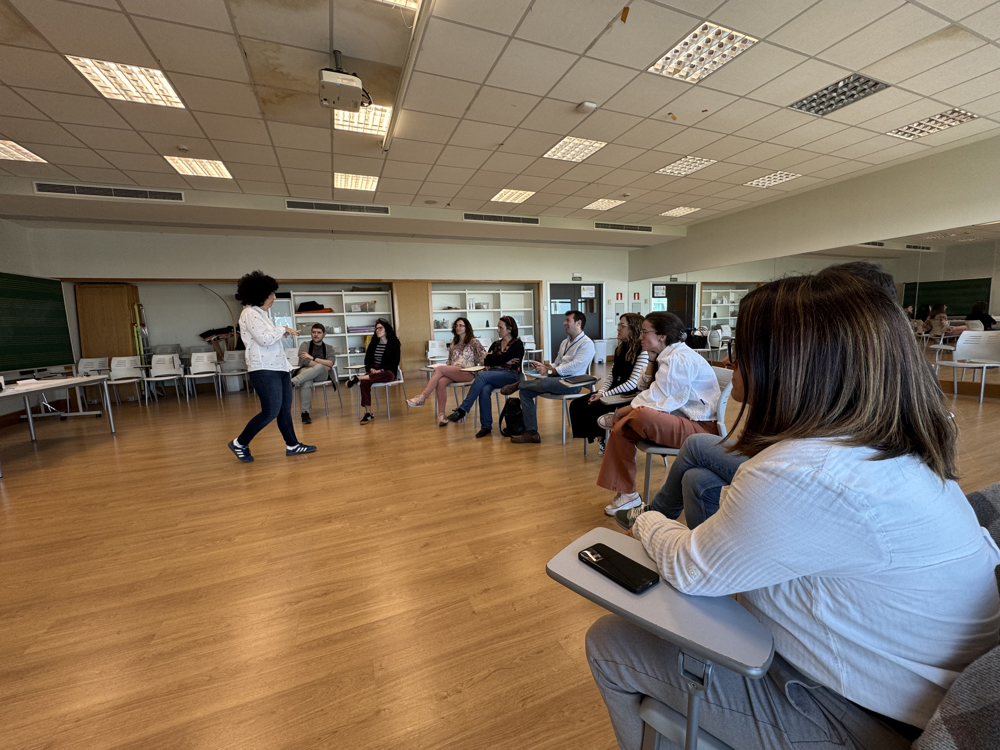

## Pla de treball 2025-2026

El projecte s'articula en tres eixos metodològics: **aprenentatge actiu i col·laboratiu**, **treball per projectes** i **avaluació formativa i participativa**.

| Període | Activitat | Destinataris |
|---------|-----------|--------------|
| Set–Oct 2025 | Workshop amb logopeda i musicoterapeuta: prevenció de disfonies i tècnica vocal (via SFP) | Professorat participant |
| Novembre 2025 | Taller vocal SAC: higiene vocal, pràctiques i consells | Estudiantat de grau |
| Febrer 2026 | Taller vocal SAC: higiene vocal, pràctiques i consells | Estudiantat de grau |
| Nov 2025–Març 2026 | Tallers de cant coral: tècnica vocal i aplicació didàctica | Estudiantat i PDI |
| Oct 2025–Maig 2026 | Activitats de cant coral i educació vocal a les assignatures | Estudiantat |
| Abr–Maig 2026 | Gravació d'activitat coral i autoavaluació | Tots els participants |
| Juny 2026 | Jornada de presentació interna de resultats | Comunitat UV |
| Juliol 2026 | Redacció i lliurament de la memòria final | Equip coordinador |

---

## Curs de formació: PreVeu

**La veu com a eina docent: acció i prevenció**

Curs organitzat pel **Servei de Formació Permanent i Innovació Educativa (SFPIE)** de la Universitat de València, en el marc del projecte PREVEU.

| | |
|---|---|
| **Dates** | 30 octubre – 7 novembre 2025 |
| **Durada** | 15 hores (presencial + en línia asíncrona) |
| **Lloc** | Facultat de Formació del Professorat, aules P4.01, P4.04 i P4.08 |
| **Participants** | 18 |

**Programa:**

| Data | Horari | Modalitat |
|------|--------|-----------|
| 30 octubre 2025 | 1h | En línia asíncrona |
| 3 novembre 2025 | 12:00–14:00 i 17:30–19:30 | Presencial |
| 4 novembre 2025 | 11:30–14:30 i 17:30–20:30 | Presencial |
| 5–7 novembre 2025 | 4h | En línia asíncrona |

**Docents:**

| Nom | Hores |
|-----|-------|
| Clara Puig Herreros | 6h |
| Chantal Esteve Royo | 6h |
| Isabel Monar | 3h |

---

## Galeria

::: {layout-ncol=2}

:::

---

## Assignatures implicades

El projecte es desenvolupa principalment en els **Graus de Mestre/a d'Educació Infantil i Primària** i el **Màster Universitari en Professorat de Secundària**, entre d'altres.

| Codi | Assignatura |
|------|-------------|
| 33646 | Didàctica de la música en l'educació primària |
| 33677 | Educació vocal |
| 33679 | Didàctica musical |
| 33621 | Processos musicals en l'educació infantil |
| 33614 | Estimulació i intervenció primerenca: música, grafisme i moviment |
| 36296 | Intervenció en trastorns de la veu i la parla |
| 36304 | L'educació física, plàstica i musical i la seua didàctica en les NEE |
