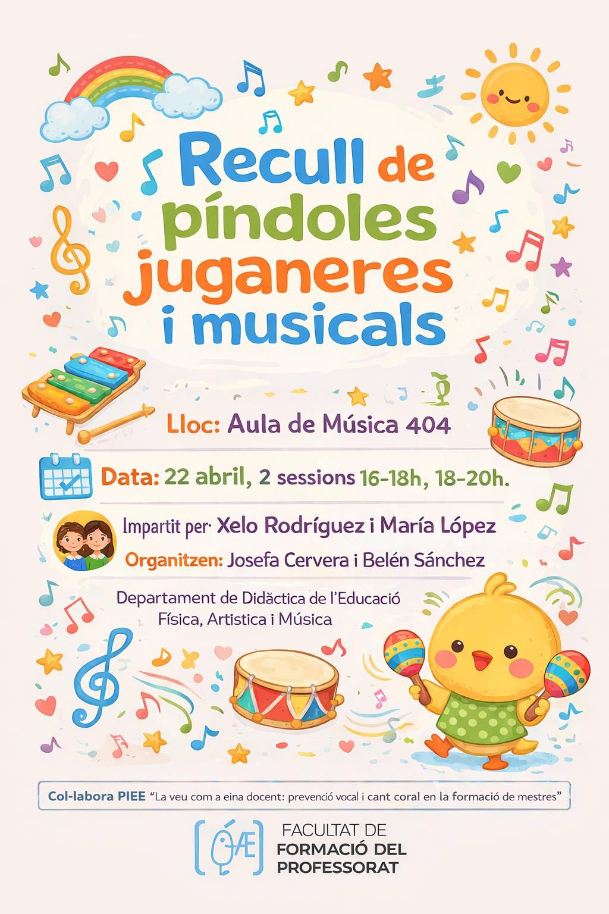

## Curs de formació: PreVeu

**La veu com a eina docent: acció i prevenció**

Curs organitzat pel **Servei de Formació Permanent i Innovació Educativa (SFPIE)** de la Universitat de València, en el marc del projecte PREVEU.

| | |
|---|---|
| **Dates** | 30 octubre – 7 novembre 2025 |
| **Durada** | 15 hores (presencial + en línia asíncrona) |
| **Lloc** | Facultat de Formació del Professorat, aules P4.01, P4.04 i P4.08 |
| **Participants** | 18 |

**Programa:**

| Data | Horari | Modalitat |
|------|--------|-----------|
| 30 octubre 2025 | 1h | En línia asíncrona |
| 3 novembre 2025 | 12:00–14:00 i 17:30–19:30 | Presencial |
| 4 novembre 2025 | 11:30–14:30 i 17:30–20:30 | Presencial |
| 5–7 novembre 2025 | 4h | En línia asíncrona |

**Docents:**

| Nom | Hores |
|-----|-------|
| Clara Puig Herreros | 6h |
| Chantal Esteve Royo | 6h |
| Isabel Monar | 3h |

---

## Galeria

::: {layout-ncol=2}

:::

---

## Píndoles juganeres i musicals

**Recull de píndoles juganeres i musicals**

Activitat organitzada per la professora **Josefa Cervera Martínez** i **Belén Sánchez García**, en el marc del projecte PREVEU.

| | |
|---|---|
| **Data** | 22 d'abril de 2026 |
| **Sessions** | 16:00–18:00h i 18:00–20:00h |
| **Lloc** | Aula P4.04, Facultat de Formació del Professorat |
| **Impartit per** | Xelo Rodríguez i María López |

::: {layout-ncol=2}

:::

